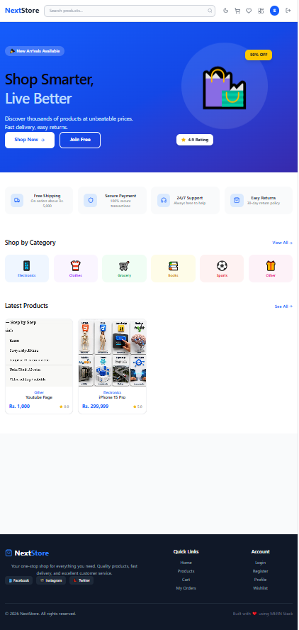
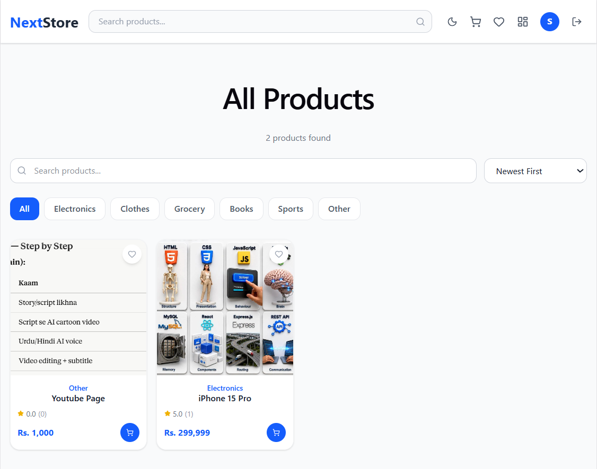
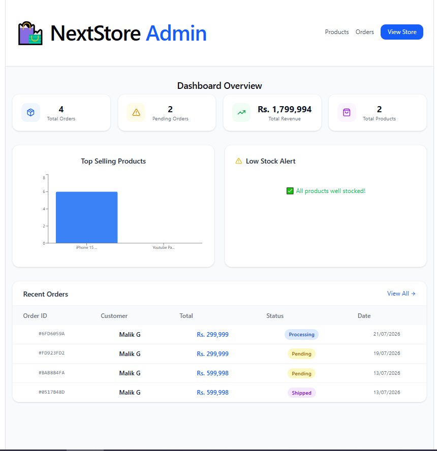
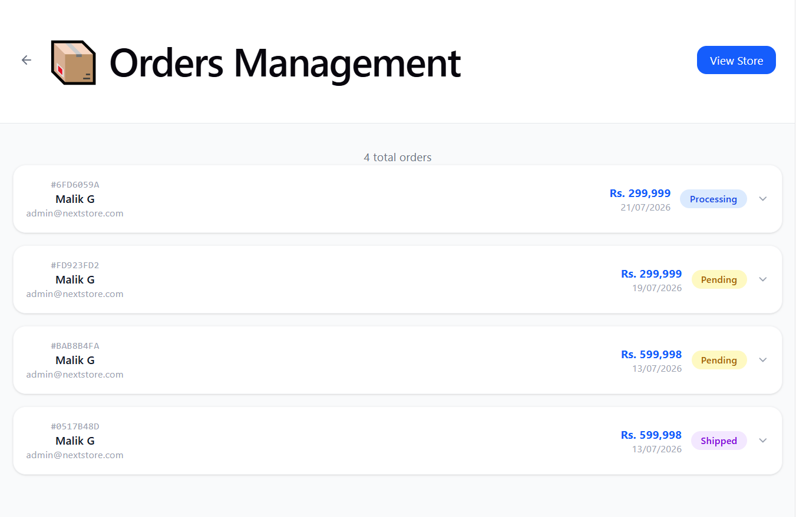

# 🛍️ NextStore — Full Stack E-Commerce Platform

A production-ready full-stack e-commerce application built with the MERN stack. Features a complete shopping experience with admin dashboard, real-time order management, and email notifications.

## 🔗 Live Demo

- **Frontend:** [nextstore.vercel.app](https://nextstore.vercel.app)
- **Backend API:** [nextstore-api.vercel.app](https://nextstore-api.vercel.app)

**Demo Credentials:**
| Role | Email | Password |
|------|-------|----------|
| Admin | admin@nextstore.com | admin123 |
| Customer | customer@test.com | test123 |

## ✨ Features

**Customer Side:**
- 🔐 JWT Authentication (Register/Login)
- 🛒 Shopping Cart (persists per user)
- 💳 Cash on Delivery + Stripe Payment
- ❤️ Wishlist (save for later)
- ⭐ Product Reviews & Star Ratings
- 📦 Order History with real-time status
- 🔍 Search, Filter & Sort products
- 🌙 Dark/Light Mode toggle

**Admin Side:**
- 📊 Dashboard with Revenue & Sales charts
- 📦 Products Management (Add/Edit/Delete + Image Upload)
- 🚚 Orders Management with status updates
- ⚠️ Low Stock Alerts
- 📧 Automatic email notifications to customers

## 🛠️ Tech Stack

| Layer | Technology |
|-------|-----------|
| Frontend | React.js, Vite, Tailwind CSS v4 |
| Backend | Node.js, Express.js |
| Database | MongoDB Atlas, Mongoose |
| Auth | JWT, bcrypt.js |
| Email | Nodemailer (Gmail) |
| Images | Cloudinary |
| Deployment | Vercel |

## 📸 Screenshots

### Home Page


### Products Page


### Admin Dashboard


### Order Management


## 🚀 Local Setup

### Backend
```bash
cd server
npm install
# .env file banayein (see .env.example)
npm run dev
```

### Frontend
```bash
cd client
npm install
npm run dev
```

### Environment Variables (server/.env)
```env
PORT=5000
MONGO_URI=your_mongodb_connection_string
JWT_SECRET=your_jwt_secret
EMAIL_USER=your_gmail@gmail.com
EMAIL_PASS=your_gmail_app_password
ADMIN_EMAIL=your_gmail@gmail.com
CLOUDINARY_CLOUD_NAME=your_cloud_name
CLOUDINARY_API_KEY=your_api_key
CLOUDINARY_API_SECRET=your_api_secret
```

## 📝 API Endpoints

| Method | Endpoint | Description |
|--------|----------|-------------|
| POST | `/api/auth/register` | Register new user |
| POST | `/api/auth/login` | Login |
| GET | `/api/products` | Get all products (search/filter) |
| POST | `/api/products` | Add product (Admin) |
| POST | `/api/orders` | Place order |
| GET | `/api/orders/myorders` | Get my orders |
| PUT | `/api/orders/:id/status` | Update order status (Admin) |
| POST | `/api/reviews/:productId` | Add review |
| POST | `/api/wishlist/:productId` | Toggle wishlist |

## 👨‍💻 Author

**Muhammad Shoaib Malik** — MERN Stack Developer

- GitHub: [@shoaib7635](https://github.com/shoaib7635)
- LinkedIn: [your-linkedin-url]